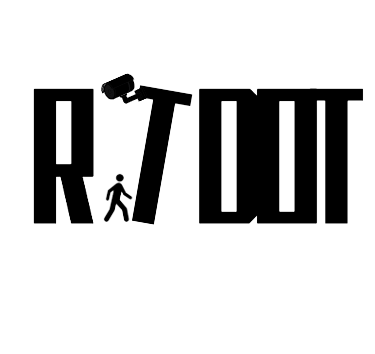

# Real Time Department Occupation Tracker



Project made for the subject of Networks and Autonomous Systems, in the 4th year of the Computer Engineering course at the University of Aveiro.

The main purpose of this project is to create a system that allows the real time tracking of the occupation of the different departments of the University of Aveiro.
We archieve this by implementing a B.A.T.M.A.N. network, which is a routing protocol that allows the creation of a mesh network and by implementing a object detection model YOLOv8 that allows us to detect people in a given image. People detected will be tracked to see if they are entering or leaving a department.


## Running the project

Install dependencies:

```bash
pip install -r requirements.txt
```

Run the Project:

This configuration is working with the Jetson Master serving as the Dashbard and receiving messages from the Jetson_Worker_Down_Up model.

Keep in mind that the paths on the setup.sh are relative to the jetson configuration
```bash 
setup.sh wlan0 <batman_ip>
```

Local Run:
Local run can only be accomplished by running the detection scripts Jetson_Worker_Down_Up.py and Jetson_Worker_Left_Right.py
```bash
python Jetson_Worker_Down_Up.py
```
Or:
```bash
python Jetson_Worker_Left_Right.py
```


